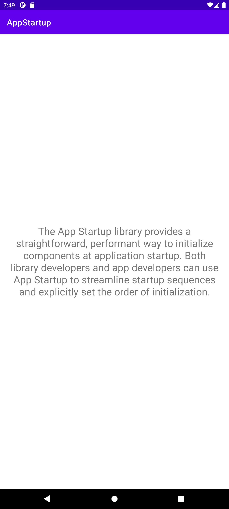

<div>


</div>

# App Startup
*The App Startup library* provides a straightforward, performant way to initialize components at application startup.
<br><br>


#### 1. Initialize
```groovy
dependencies {
    implementation "androidx.startup:startup-runtime:1.1.1"
}
```
<br>

#### 2. Application()
- When initializing *Timber*, would have been written as follows.
```kotlin
class MainApplication : Application() {
    override fun onCreate() {
        super.onCreate()
        if (BuildConfig.DEBUG) {
            Timber.plant(Timber.DebugTree())
        }
    }
}
```

- Or when the application context is needed to initialize the components,
- It may have been written in the `onCreate()` function of the `Application()` class.

```kotlin
class MainApplication : Application() {
    override fun onCreate() {
        super.onCreate()
        KakaoSdk.init(this, appKey)
        NaverIdLoginSDK.initialize(this, clientId, clientSecret, clientName)
    }
}
```
<br>

#### 3. Initializer&lt;T>
- `Initializer` can be used to initialize libraries during app startup.
- Without the need to use additional *ContentProvider*.
```java
public interface Initializer<T> {
    @NonNull
    T create(@NonNull Context context);

    @NonNull
    List<Class<? extends Initializer<?>>> dependencies();
}
```
<br>

#### 3-1. Implement component initializers
- Create a class that implements the `Initializer<T>`.
```kotlin
class TimberInitializer : Initializer<Unit> {
    override fun create(context: Context) {
        if (BuildConfig.DEBUG) {
            Timber.plant(Timber.DebugTree())
            Timber.d("Timber is initialized.")
        }
    }

    override fun dependencies(): List<Class<out Initializer<*>>> {
        return emptyList()
    }
}
```
<br>

#### 3-2. create()
- Initialize components with application context during app startup.
- It takes `context` as a parameter and returns  `the initialized component <T>`.
<br>

#### 3-3. dependencies()
- Can use App Startup to explicitly set the order of initialization.
- Can define *dependencies* between initializers.
  - For example, let's say need to initialize `Timber` before initializing `Koin`.
  - Simply for the log that the `Koin` has been initialized.
  - *TimberInitializer* is returned from `dependencies()`.
  - Since there may be several, it is returned *in the form of a list*.
```kotlin
class KoinInitializer : Initializer<Unit> {
    override fun create(context: Context) {
        startKoin {
            androidContext(context)
            modules(repositoryModule)
            modules(viewModelModule)
            Timber.d("Koin is initialized.")
        }
    }

    override fun dependencies(): List<Class<out Initializer<*>>> {
        return listOf(TimberInitializer::class.java)
    }
}
```
- If there are no dependencies, return an empty list.
<br>

#### 4. Set up AndroidManifest.xml
- In app startup, there is an `InitializationProvider` that inherits *ContentProvider*.
- Find and initialize `Initializers` using `InitializationProvider` and *AppInitializer*.
  - First, &lt;meta-data> in the *AndroidManifest.xml* are discovered.
  - And check the [dependencies()](#3-3-dependencies) of the found Initializers.
- Initializers that can be found in *dependencies()* do not need to be written to &lt;meta-data>.
  - [TimberInitializer](#3-1-implement-component-initializers) can be found in [KoinInitializer](#3-3-dependencies).
  - Don't need to write TimberInitializer in &lt;meta-data>.
```xml
<provider
    android:name="androidx.startup.InitializationProvider"
    android:authorities="com.kimym.startup.androidx-startup"
    android:exported="false"
    tools:node="merge">
    <meta-data
    	android:name="com.kimym.startup.initializer.KoinInitializer"
        android:value="androidx.startup" />
    <!--don't need to write TimberInitializer-->
    <meta-data
        android:name="com.kimym.startup.initializer.TimberInitializer"
        android:value="androidx.startup" />
</provider>
```
<br>

#### 4-1. Disable automatic initialization
- Can disable automatic initialization by adding `tools:node="remove"` for individual elements.
- `tools:node="remove"` in the entry instead of simply removing the entry.
- In order to make sure that the merger tool also removes the entry from all other merged manifest files.
```xml
<meta-data
    android:name="com.kimym.startup.initializer.KoinInitializer"
    tools:node="remove" />
```

- To disable all automatic initialization,
- Remove the entire entry for `InitializationProvider` from the manifest:
```xml
<provider
    android:name="androidx.startup.InitializationProvider"
    android:authorities="${applicationId}.androidx-startup"
    tools:node="remove" />
```
<br>

#### 4-2. initializeComponent()
- can initialize manually by using initializeComponent() of AppInitializer.
- It takes the class of Initializer as a parameter and calls doInitializer().
```java
@NonNull
@SuppressWarnings("unused")
public <T> T initializeComponent(@NonNull Class<? extends Initializer<T>> component) {
    return doInitialize(component);
}
```

- Write the following to call.
```kotlin
val initializer = AppInitializer.getInstance(context)
initializer.initializeComponent(KoinInitializer::class.java)
```
<br>

#### 5. InitializationProvider
- Get the `applicationContext` and use it to get an instance of `AppInitializer`.
  -  *AppInitializer.getInstance(context).discoverAndInitialize();*
```java
public class InitializationProvider extends ContentProvider {
    @Override
    public final boolean onCreate() {
        Context context = getContext();
        if (context != null) {
            Context applicationContext = context.getApplicationContext();
            if (applicationContext != null) {
                AppInitializer.getInstance(context).discoverAndInitialize();
            } else {
                StartupLogger.w("Deferring initialization because `applicationContext` is null.");
            }
        } else {
            throw new StartupException("Context cannot be null");
        }
    }
}
```
<br>

#### 5-1. AppInitializer.getInstance(context)
- AppInitializer is implemented as *a singleton pattern*.
- When initialized for the first time, some elements are initialized together.
  - `mContext` : It is passed to the [create()](#3-initializert) method of the *Initializer*.
  - `mDiscovered` : Find the *Initializer* and put it here. Repeat `doInitialize()` on the contained elements.
  - `mInitialized` : This is a map containing *Initializer* that has been initialized
```java
public final class AppInitializer {
    
    private static final String SECTION_NAME = "Startup";

    private static volatile AppInitializer sInstance;

    private static final Object sLock = new Object();

    @NonNull
    final Map<Class<?>, Object> mInitialized;

    @NonNull
    final Set<Class<? extends Initializer<?>>> mDiscovered;

    @NonNull
    final Context mContext;
        
    AppInitializer(@NonNull Context context) {
        mContext = context.getApplicationContext();
        mDiscovered = new HashSet<>();
        mInitialized = new HashMap<>();
    }
    
    @SuppressWarnings("UnusedReturnValue")
    public static AppInitializer getInstance(@NonNull Context context) {
        if (sInstance == null) {
            synchronized (sLock) {
                if (sInstance == null) {
                    sInstance = new AppInitializer(context);
                }
            }
        }
        return sInstance;
    }    
}
```
<br>

#### 5-2. discoverAndInitialize()
- `provider` : ComponentInfo{packageName/androidx.startup.InitializationProvider}.
- `providerInfo` : ContentProviderInfo{name = packageName.androidx-startup className=androidx.startup.InitializationProvider}.
- `metadata` : These are the meta-data of the provider declared in the [manifest](#4-set-up-androidmanifestxml).
```java
void discoverAndInitialize() {
    try {
        Trace.beginSection(SECTION_NAME);
        ComponentName provider = new ComponentName(mContext.getPackageName(), InitializationProvider.class.getName());
        ProviderInfo providerInfo = mContext.getPackageManager().getProviderInfo(provider, GET_META_DATA);
        Bundle metadata = providerInfo.metaData;
        discoverAndInitialize(metadata);
    } catch (PackageManager.NameNotFoundException exception) {
        throw new StartupException(exception);
    } finally {
        Trace.endSection();
    }
}
```
<br>

#### 5-3. androidx.startup.R.string.androidx_startup
```xml
<?xml version="1.0" encoding="utf-8"?>
<resources>
    <string name="androidx_startup" translatable="false">androidx.startup</string>
</resources>
```
<br>

#### 5-4. discoverAndInitialize(bundle)
- In this project, the bundle passed to this method contains the following elements.
  - {androidx.emoji2.text.EmojiCompatInitializer=androidx.startup}
  - {androidx.lifecycle.ProcessLifecycleInitializer=androidx.startup}
  - {com.kimym.startup.initializer.KoinInitializer=androidx.startup}
- The value obtained by using metadata.getString(key, null) is "androidx.startup".
- The Class returned as Class.forName(key) would have implemented the Initializer.
  - *Initializer.class.isAssignableFrom(clazz)*.
- Therefore, it is added to [mDiscovered](#5-1-appInitializergetInstancecontext).
- After repeating this process, `doInitialize()` is performed for each element in *mDiscovered*.
```java
@SuppressWarnings("unchecked")
void discoverAndInitialize(@Nullable Bundle metadata) {
    String startup = mContext.getString(R.string.androidx_startup);
    try {
        if(metadata != null) {
            Set<Class<?>> initializing = new HashSet<>();
            Set<String> keys = metadata.keySet();
            for (String key : keys) {
                String value = metadata.getString(key, null);
                if (startup.equals(value)) {
                    Class<?> clazz = Class.forName(key);
                    if (Initializer.class.isAssignableFrom(clazz)) {
                        Class<? extends Initializer<?>> component = (Class<? extends Initializer<?>>) clazz;
                        mDiscovered.add(component);
                        if (StartupLogger.DEBUG) {
                            StartupLogger.i(String.format("Discovered %s", key));
                        }
                    }
                }
            }
            // Initialize only after discovery is complete.
            // This way, the check for isEagerlyInitialized is correct.
            for (Class<? extends Initializer<?>> component : mDiscovered) {
                doInitialize(component, initializing);
            }
        }
    } catch (ClassNotFoundException exception) {
        throw new StartupException(exception);
    }
}
```
<br>

#### 5-5. doInitialize()
- To prevent duplicate initialization, `Set<Class<?>> initializing` contains the element currently being initialized.
- Similarly, to prevent duplicate initialization, [mInitialized](#5-1-appInitializergetInstancecontext) contains elements that have been initialized.
- If there is an element in mInitialized, get it immediately.
- Initialize the elements that are not contained initializing and mInitialized.
1. Create an instance for the component and cast it as Initializer&lt;?>.
2. If the dependencies are not empty by checking the dependencies in the instance,
3. doInitialize() is first executed for each component of the dependencies.
4. After that, create() is performed and the value returned by create() is returned.
```java
@NonNull
@SuppressWarnings({"unchecked", "TypeParameterUnusedInFormals"})
private <T> T doInitialize(@NonNull Class<? extends Initializer<?>> component, @NonNull Set<Class<?>> initializing) {
    boolean isTracingEnabled = Trace.isEnabled();
    try {
        if (isTracingEnabled) {
            // Use the simpleName here because section names would get too big otherwise.
            Trace.beginSection(component.getSimpleName());
        }
        if (initializing.contains(component)) {
            String message = String.format(
                    "Cannot initialize %s. Cycle detected.", component.getName()
            );
            throw new IllegalStateException(message);
        }
        Object result;
        if (!mInitialized.containsKey(component)) {
            initializing.add(component);
            try {
                Object instance = component.getDeclaredConstructor().newInstance();
                Initializer<?> initializer = (Initializer<?>) instance;
                List<Class<? extends Initializer<?>>> dependencies =
                initializer.dependencies();

                if (!dependencies.isEmpty()) {
                    for (Class<? extends Initializer<?>> clazz : dependencies) {
                        if (!mInitialized.containsKey(clazz)) {
                            doInitialize(clazz, initializing);
                        }
                    }
                }
                if (StartupLogger.DEBUG) {
                    StartupLogger.i(String.format("Initializing %s", component.getName()));
                }
                result = initializer.create(mContext);
                if (StartupLogger.DEBUG) {
                    StartupLogger.i(String.format("Initialized %s", component.getName()));
                }
                initializing.remove(component);
                mInitialized.put(component, result);
            } catch (Throwable throwable) {
                throw new StartupException(throwable);
            }
        } else {
            result = mInitialized.get(component);
        }
        return (T) result;
    } finally {
        Trace.endSection();
    }
}
```
<br>

#### 5-6. StartupLogger.DEBUG
```java
public final class StartupLogger {
    ...
    /**
     * To enable logging set this to true.
     */
    static final boolean DEBUG = false;
    ...
}
```
<br>

##### Reference

- https://developer.android.com/topic/libraries/app-startup
